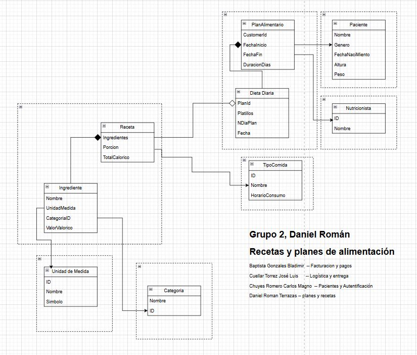

# 🍽️ Master Recipe & Nutrition Manager

> Gestor integral diseñado para administrar un catálogo maestro de recetas, ingredientes y planes de alimentación, enfocándose en la información nutricional y la organización del contenido.

---

## ✨ Características Principales

Este proyecto ofrece un conjunto robusto de herramientas para la gestión de contenido culinario y dietético.

### 1. 📖 Catálogo Maestro de Recetas

Gestiona el núcleo de la aplicación con un control exhaustivo sobre las recetas:

* **Ingredientes Detallados:** Definición de todos los componentes necesarios para cada plato.
* **Pasos de Preparación:** Instrucciones claras y estructuradas sobre el proceso de elaboración.

### 2. 📊 Gestión Nutricional y Clasificación

Permite categorizar y clasificar el contenido basándose en el valor nutricional.

* **Valor Calórico (Macro):** Define y calcula el aporte calórico de cada receta o porción para un seguimiento dietético.
* **Agrupación de Ingredientes:** Los ingredientes se organizan por **categorías temáticas** (`Verduras`, `Proteínas`, `Lácteos`, etc.).
* **Agrupación de Recetas:** Las recetas se clasifican automáticamente por **nivel calórico** (e.g., *Bajo*, *Medio*, *Alto*).

### 3. 📅 Planificación Dietética

Ofrece herramientas para crear programas de alimentación a medida.

* **Creación de Dietas:** Permite **diseñar y personalizar dietas** combinando recetas del catálogo.
* **Generación de Planes:** Facilita la construcción de **planes de alimentación** estructurados y detallados para días o semanas específicas.

---

## 🤝 Contribución

# planes-recetas-nur
